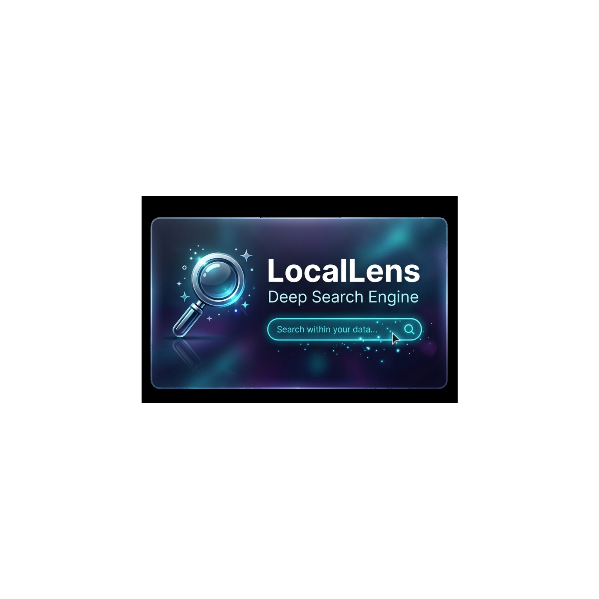
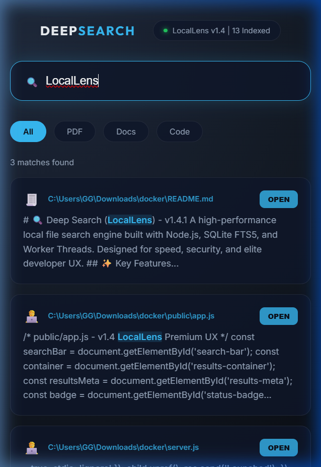
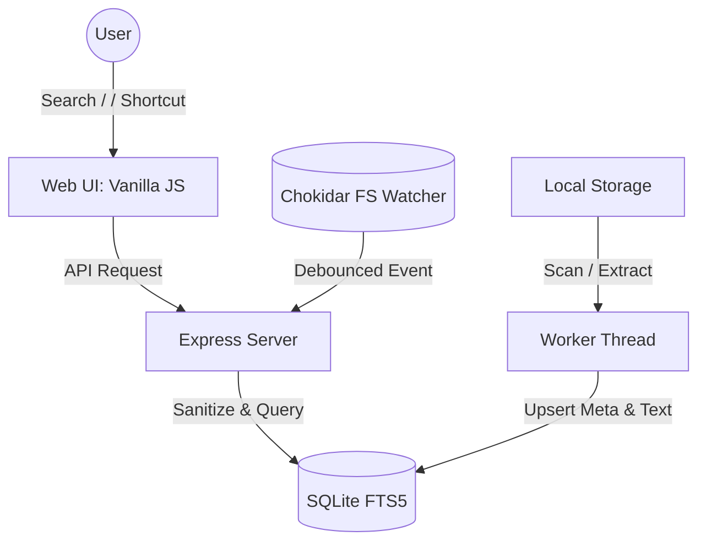

# 🔍 Deep Search (LocalLens) - v1.4.1



A high-performance local file search engine built with Node.js, SQLite FTS5, and Worker Threads. Designed for speed, security, and elite developer UX.

## ✨ Key Features

- **⚡ Super-Fast Search**: Uses SQLite FTS5 for native full-text indexing and instant snippet highlighting.
- **🔄 Real-time Indexing**: Powered by `chokidar`. Every disk update (add, edit, delete) is instantly broadcast to the engine.
- **🛡️ Hardened Security**: Strictly sandboxed file access (Path Jail via absolute path validation) and shell-injection-proof file opening via `child_process.spawn`.
- **🚀 Multi-threaded Architecture**: Background indexing via Worker Threads keeps the main UI thread silky smooth.
- **🌍 Native Platform Support**: Cross-platform open commands for Windows, macOS, and Linux.
- **🧠 Intelligent Incremental Sync**: Only re-indexes files if metadata signatures (size + mtime) have changed.
- [x] **🎹 Power User UX**: 
  - Keyboard focus shortcut (`/`)
  - Filter by category (PDF, Docs, Code)
  - Semantic file-type icons
  - Real-time status pulse

### 📸 Live Demo


## 🏗️ Architecture Diagram



## 📦 Engineering Setup

1.  **Prerequisites**: [Node.js](https://nodejs.org/) (v18+ recommended).

2.  **Install Dependencies**:
    ```bash
    npm install
    ```

3.  **Configure Search Path**:
    Open `config.js` and set your desired `scanPath`. By default, it indexes the project folder.

4.  **Launch the Engine**:
    ```bash
    npm start
    ```

5.  **Access LocalLens**:
    Open your browser to: `http://localhost:3000`

## 🛰️ Engineering Roadmap

- [x] v1.3: Security, Path Jailing & Platform Support
- [x] v1.4: Elite Polish & "LocalLens" Identity
- [x] v1.4.1: Robust Path Sandbox & Documentation Polish
- [ ] v2.0: Advanced OCR support for Scanned Image/PDFs
- [ ] v2.1: Local AI embeddings (Semantic Search)
